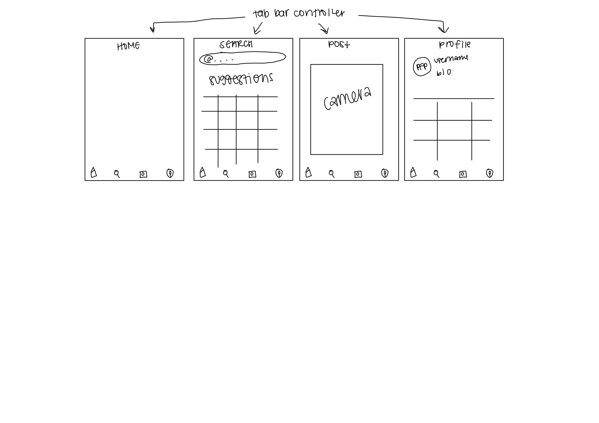

Original App Design Project - README
===

# BibleReels

## Table of Contents

1. [Overview](#Overview)
2. [Product Spec](#Product-Spec)
3. [Wireframes](#Wireframes)
4. [Schema](#Schema)

## Overview
BibleReels is an app that connects people all over the world who wish to stay consistent in reading the Holy Bible by maintaining a streak and pushing each other to strive hgiher. 

### Description

[Description of your app]

### App Evaluation

[Evaluation of your app across the following attributes]
- **Category:** Photo, video, social
- **Mobile:** Includes use of a camera
- **Story:**  Allows users to track their Bible reading habits and keep a streak
- **Market:** Anybody willing to stay consistent in their Bible reading/studies
- **Habit:**  Users can connect with friends and update when they've read their Bible for the day
- **Scope:** Can expand to have "stories" or some way to post more about what you've learned from what you've read

## Product Spec

### 1. User Stories (Required and Optional)

**Required Must-have Stories**

* User can post a new photo to their feed
* User can create a new account
* User can login
* User can search for other users
* User can like a photo
* User can follow/unfollow another user
* User can view a feed of photos

**Optional Nice-to-have Stories**

* User can add a comment to a photo
* User can tap a photo to view a more detailed photo screen with comments
* User can search for photos by a Bible key word, book, chapter, or verse
* User can see notifications when their photo is liked or they are followed
* User can see their profile page with their photos
* User can see a list of their followers
* User can see a list of their following
* User can view other user’s profiles and see their photo feed

### 2. Screen Archetypes

- [ ] Login Screen
* User can login

- [ ] Registration Screen
* User can create a new account

- [ ] Stream
* User can view a feed of photos
* User can double tap a photo to like

- [ ] Creation
* User can post a new photo to their feed

- [ ] Search
* User can search for other users
* User can follow/unfollow another user

### 3. Navigation

**Tab Navigation** (Tab to Screen)

* Home
* Search for/by
* Post

**Flow Navigation** (Screen to Screen)

- [ ] Login Screen
* --> Home
* --> Registration

- [ ] Registration Screen
* --> Home
* --> Login

- [ ] Stream
* --> Home

- [ ] Creation
* --> Home

- [ ] Search
* --> None

## Wireframes

[Add picture of your hand sketched wireframes in this section]

### [BONUS] Digital Wireframes & Mockups

### [BONUS] Interactive Prototype

## Schema 

[This section will be completed in Unit 9]

### Models

[Add table of models]

### Networking

- [Add list of network requests by screen ]
- [Create basic snippets for each Parse network request]
- [OPTIONAL: List endpoints if using existing API such as Yelp]
